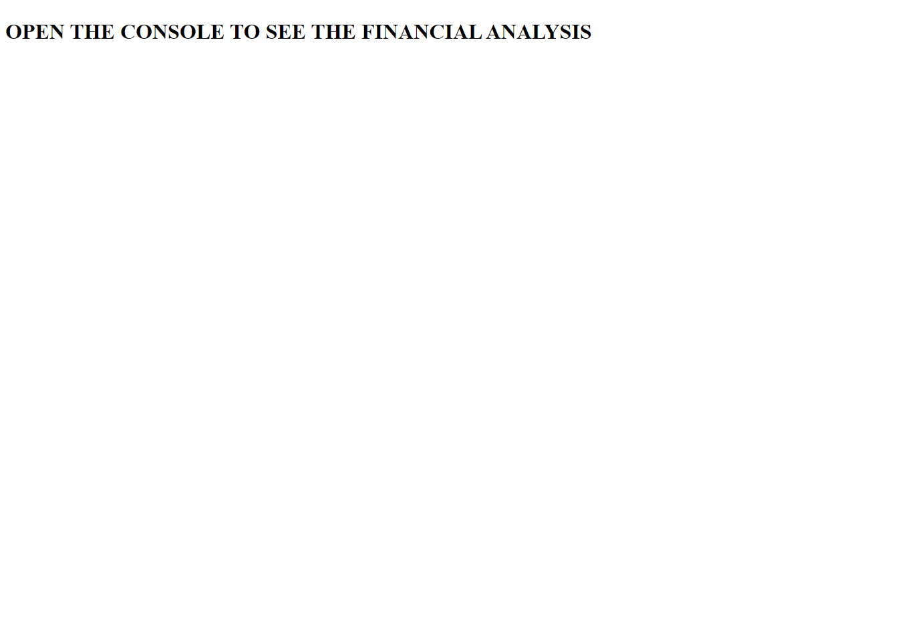

# Console-Finance

## Description 
This is my creation of JavaScript code which analyses the financial records of the company. This will aim to calculate: the total number of months included in the dataset; the net total amount of profit/losses over the entire period; the average of the changes in profit/losses over the entire period; the greatest increase in profits (date and amount) over the entire period and he greatest decrease in losses (date and amount) over the entire period.

## Screenshot

## Link to the deployed site 
[console-finance](https://natasha-16x.github.io/Console-Finance/)

## Installation 
N/a

## Usage 
right click and press inspect. click on console to see the analysis 

## Credits 
N/a

## License
MIT License